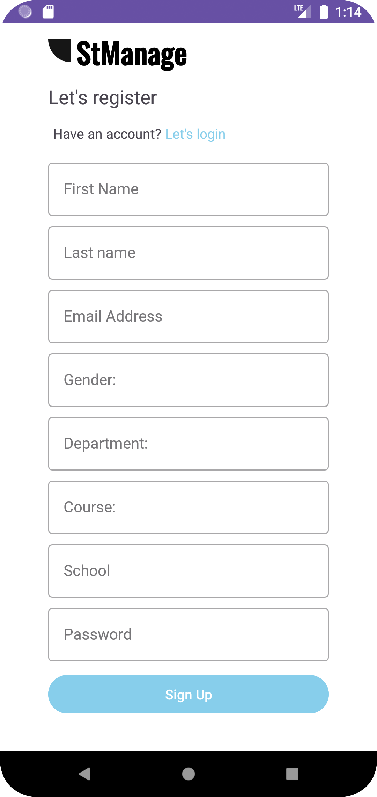
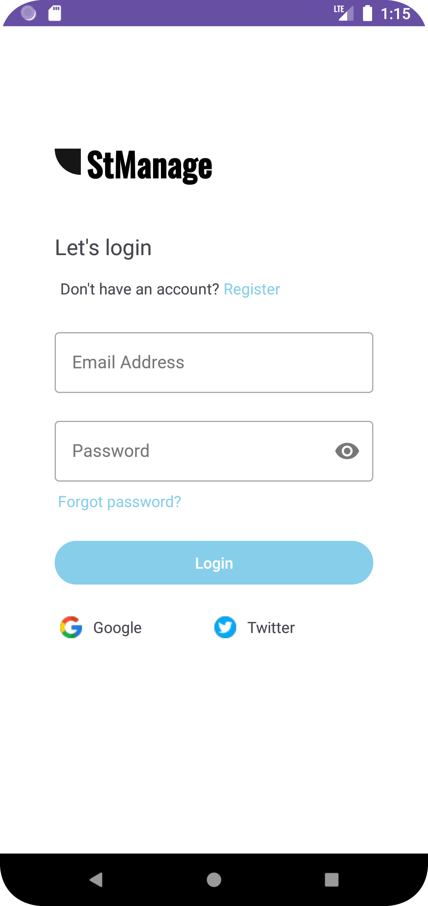
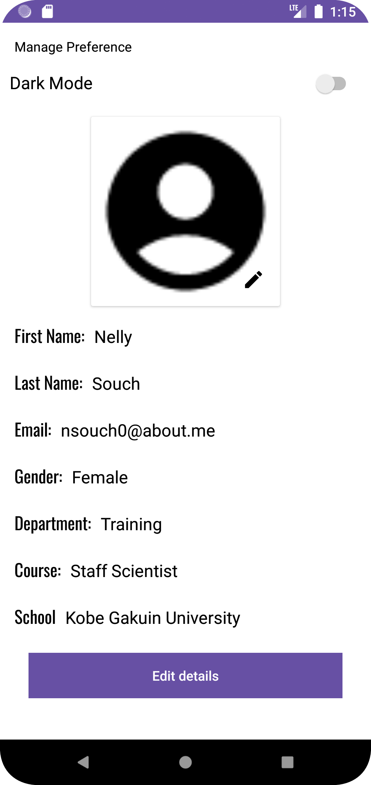
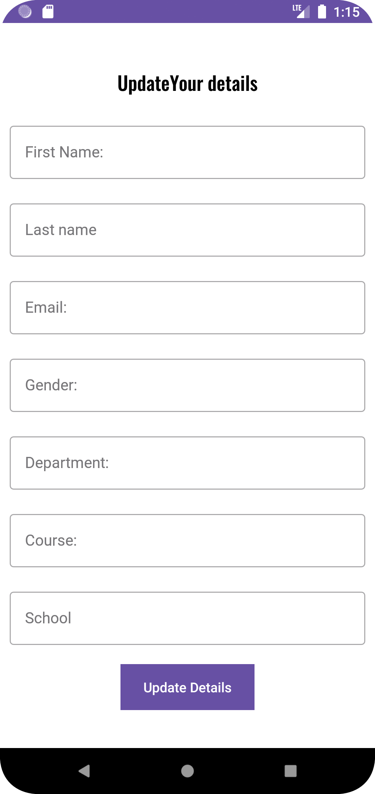
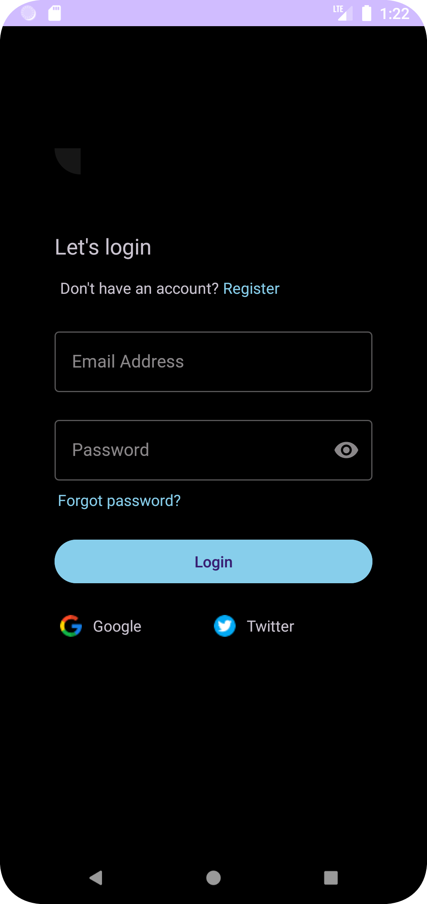
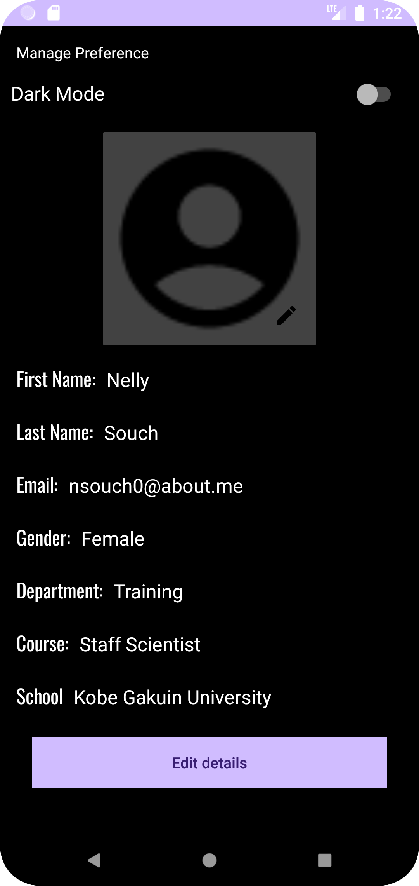
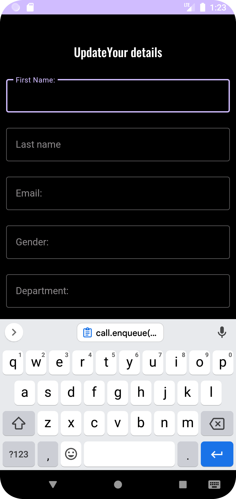

# MainAssignment
# StManage
### ManageTasks - Manage student details
StManage is an application that helps to store, retrieve and update student details. In case there is a change in the student's details, the application notifies the student of the changes.

### Screenshot and Demo
#### Light Theme
Register Screen             |  Login Screen             | Detail Screen            | Update detail Screen
:-------------------------:|:-------------------------:|:-------------------------:|:-------------------------:
  |    |  |  

#### Dark Theme
Register Screen             |  Login Screen             | Detail Screen            | Update detail Screen
:-------------------------:|:-------------------------:|:-------------------------:|:-------------------------:
  |    |   |  


### Tools and library
The following tools and libraries were used to build this app;
- [Java](https://dev.java/) - Java is a general-purpose programming language that can be used to develop Android applications and many more uses.
- [Worker thread](https://docs.oracle.com/javase/tutorial/uiswing/concurrency/worker.html) - This is a technology used to manage the threads and to ensure various activities are run on the right thread without hindering other actions. It helps manage concurrency in Android.
- [Retrofit](https://square.github.io/retrofit/) - It is an open-source library that is used to make network responses in Android applications. 

### Overall architecture
- MVVM(Model-view View-Model) architecture pattern. The model layer is responsible for fetching and storing data. The view layer is responsible for displaying the UI to the user. The ViewModel layer acts as the mediator between the view and model layers, managing the data flow and interactions.
- Clean architecture - This involves arranging the app file into modules. This makes your code clean and easy to understand.

### ManageTasks Modules
Arranging the app files into modules makes it easier to understand the flow of the app. These modules are such as;

#### Data
The data  module is responsible for fetching data from the remote API. It includes classes such as data sources, API clients, and API classes.

The data source classes are responsible for fetching data from the user and posting this data to the API, retrieving the data and updating the data.

The data models module ensures that the data is available when needed, whether online or offline, by providing a centralized interface to access the data. This module makes it easy to modify data sources, migrate data, and provides data consistency and accuracy.

#### Presentation
Everything involving the User Interface is stored here. Here we have the activities and fragments.

## Getting Started

To clone the StManage project and run it on your local machine, follow these steps:

- Open your command line interface and navigate to the directory where you want to store the project.
- Type git clone https://github.com/jumapaul/StManage.git and press Enter. This will download the project files to your local machine.
- Open Android Studio and click on "Open an existing Android Studio project" from the welcome screen. Navigate to the directory where you cloned the project and select it.
- Wait for Android Studio to build the project and download any dependencies. This may take a few minutes.
- Once the project is built, you can run it on an emulator or a physical device. To run the project, click on the green arrow in the toolbar at the top of the screen or select "Run" from the "Run" menu.

Note: Before running the project, make sure to check if you have the required tools and libraries installed, such as the Android SDK, Gradle, and any other dependencies specified in the project's build.gradle files. You may need to update these tools and libraries to their latest versions to avoid any compatibility issues.

## License

 ```
 MIT License
 
 Copyright (c) 2022 Rhe
 
 Permission is hereby granted, free of charge, to any person obtaining a copy of this software and 
 associated documentation files (the "Software"), to deal with the Software without restriction, including 
 without limitation, the rights to use, copy, modify, merge, publish, distribute, sublicense, and/or sell 
 copies of the Software, and to permit persons to whom the Software is furnished to do so, subject to 
 the following conditions:
